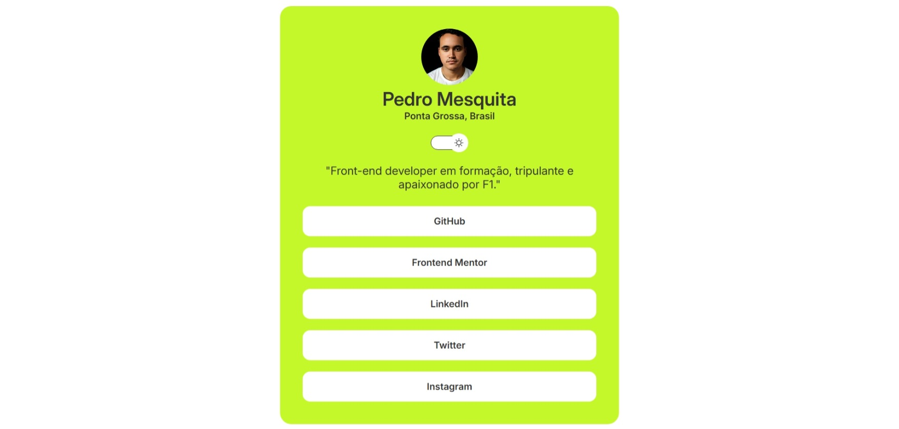

# Frontend Mentor - Social links profile solution

This is a solution to the [Social links profile challenge on Frontend Mentor](https://www.frontendmentor.io/challenges/social-links-profile-UG32l9m6dQ). Frontend Mentor challenges help you improve your coding skills by building realistic projects. 

## Table of contents

- [Overview](#overview)
  - [The challenge](#the-challenge)
  - [Screenshot](#screenshot)
  - [Links](#links)
- [My process](#my-process)
  - [Built with](#built-with)
  - [Continued development](#continued-development)
- [Author](#author)
- [Acknowledgments](#acknowledgments)

## Overview

### The challenge

Users should be able to:

- See hover and focus states for all interactive elements on the page

### Screenshot

### Links

- Solution URL: [https://github.com/PHMesquita97/Social-Links-Profile]()
- Live Site URL: [https://phmesquita97.github.io/Social-Links-Profile/]()

## My process

### Built with

- Semantic HTML5 markup
- CSS custom properties
- Flexbox
- Mobile-first workflow
- JavaScript

### Continued development

-Add Light Mode. 
-CSS animation 
-Introduction to JavaScript

## 👤 Author

- Frontend Mentor - [@PHMesquita97](https://www.frontendmentor.io/profile/PHMesquita97)
- Twitter - [@phmbraga](https://www.twitter.com/phmbraga)

## 🤝 Acknowledgments

Special thanks to Frontend Mentor for providing awesome challenges.  
